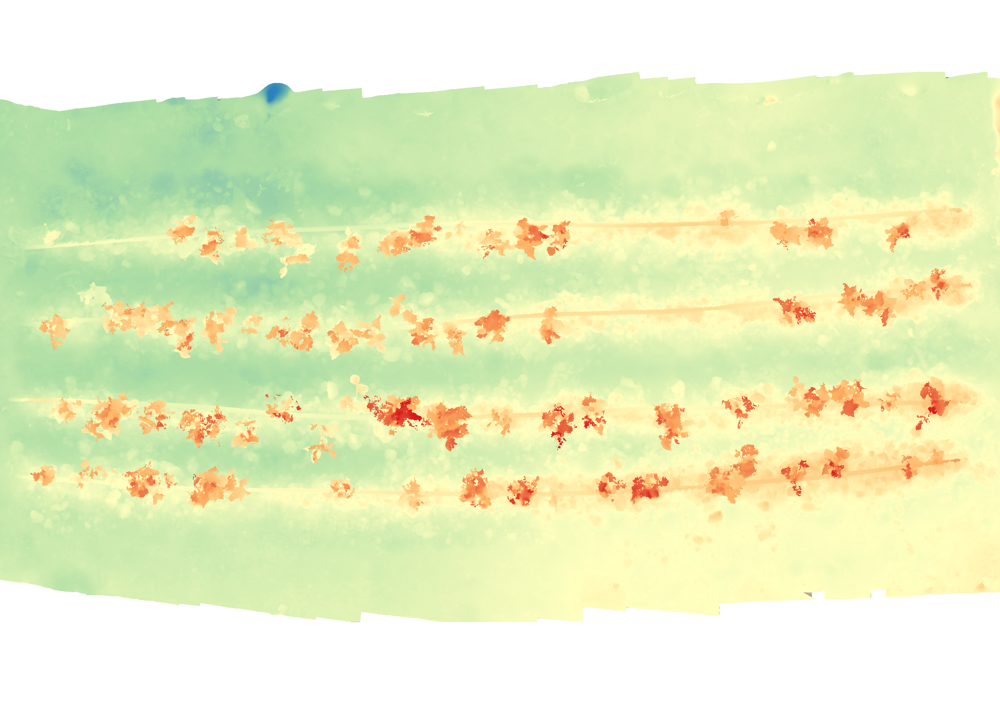

# PSARafiki-AutoSfM

PSARafiki-AutoSfM is a toolkit designed to automate the Structure from Motion (SfM) image processing pipeline using Agisoft Metashape. This repository provides scripts and utilities that facilitate the generation of 3D models, orthomosaics, digital elevation models (DEMs), and other critical outputs for photogrammetry and remote sensing applications.

## Key Features

- **Automated Processing Pipeline**: Streamlines the entire workflow, from image input to final 3D model generation, significantly reducing the need for manual intervention.
- **Pixel-to-Real-World Coordinate Mapping**: Converts pixel-based image coordinates into accurate 3D real-world coordinates, enabling precise feature identification and spatial analysis across plots.
- **Optimized for Overlapping Images**: Specifically designed to work with image sets that have at least 75% overlap both side-to-side and front-to-back, ensuring robust and accurate 3D reconstruction.

## Requirements

- **Agisoft Metashape**: A valid license for Agisoft Metashape is required to execute the processing scripts along with the Agisoft python package.
- **Compute Resources**: Adequate computing power (CPU, GPU, and memory) is necessary to handle large datasets and complex processing tasks.
- **Python 3.11**: The scripts are developed and tested using Python 3.11.
- **Image Data**: Requires a set of overlapping images with a minimum of 75% side and front overlap for optimal 3D reconstruction.

## Setup and Usage

1. **Configuration**:
   - Adjust settings in `conf/config.py` to define your `project_name` parameter.
   - Modify processing settings in `conf/asfm` to tailor the SfM process to your needs.
   - Ensure that the `project_name` defined in `conf/config.py` matches the folder name created in the `data` directory.

2. **Project Structure**:
   - Create a project folder inside the `data` directory with the same name as the project defined in `conf/config.py`.
   - Place your input images in a single folder inside the project directory: `data/{project_name}/input_images`.
   - The output will be generated in `data/{project_name}/autosfm`.

3. **Running the Pipeline**:

    - Once the configuration and setup are complete, you can run the SfM pipeline by executing the main script in your terminal:

    ```bash
    python main.py
    ```
    - This command will initiate the automated processing based on the configuration specified in conf/config.py and conf/asfm.

4. **Logging and Configuration Storage**:

    - During execution, log files are created to record the processing details and any potential errors. These logs are stored in the log directory.
    - A copy of the configuration used for each run is also saved in the log directory, ensuring that you can always trace back and reproduce the exact conditions of any processing run.

5. **Output**:
   - The `autosfm` directory will contain the processing results, including a PDF report and associated data products.
   - Reference files, such as estimated camera parameters for each image, are stored in `data/{project_name}/autosfm/reference/fov.csv`.

## Important Considerations

- **Image Overlap**: High amounts of image overlap (at least 75% side and front) are absolutely essential for successful reconstruction. Insufficient overlap or highly homogeneous ground surfaces can make the reconstruction process difficult or even impossible.
- **Image Quality**: Ensure that the images are clear and well-exposed. Poor image quality can negatively impact the accuracy of the 3D reconstruction.


### SfM data products of a single plot
- taken with an iphone 12
- made up of 80 images

#### Orthomosaic


#### Digital Elevation Model


#### Excess Green Vegetation Index
